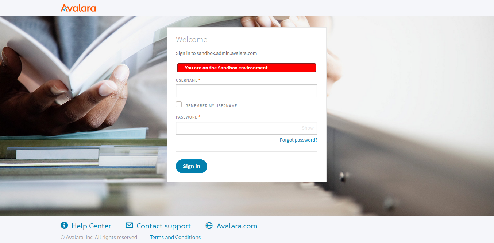
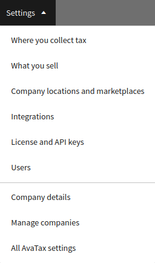
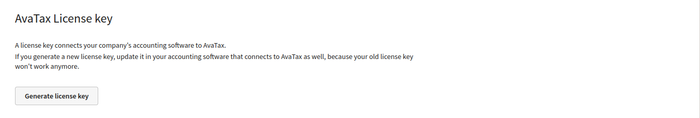
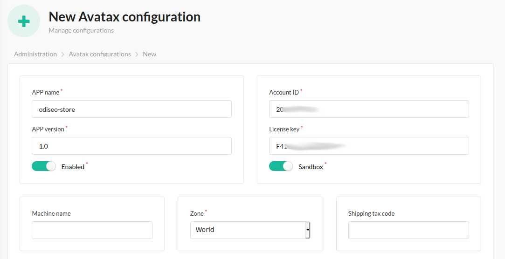

## Onboarding

To be able to use the Avatax integration as a Store Owner, you need to onboard with your Avatax account.
[Get Started](https://buy.avalara.com/signup)

#### BEWARE!

Remember, that in the following steps we help you to use the sandbox mode - so you need to onboard with a sandbox account.

1. [Sign](https://ai-sbx.avlr.sh/account/login?returnUrl=%2Fconnect%2Fauthorize%2Fcallback%3Fresponse_type%3Dcode%26client_id%3Dcustomer-portal-sbx%26redirect_uri%3Dhttps%253A%252F%252Fsandbox.admin.avalara.com%252Fauth%252Fcallback%26scope%3Dopenid%2520avatax%2520openid%2520profile%2520offline_access) in the Avalara sandbox admin:

   

2. Click **License and API keys** in the top bar menu:

   

3. Generate your Avatax License key:

   

4. With this credentials, go to the admin section and add it on the Avatax Configuration:

   

   #### BEWARE!

   Please ensure, to configure the zone where the taxes will be applied.

If everything is ok, you are able to use an Avatax integration 🎉

### Avatax codes

This plugin uses Avatax codes by default for products and shipping, but you can configure it.

1. Find the codes that best suit your Store in the [Tax Codes Search](https://taxcode.avatax.avalara.com/):
