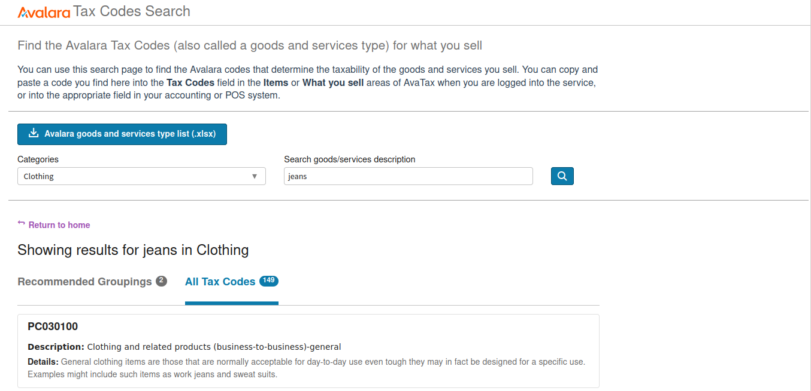
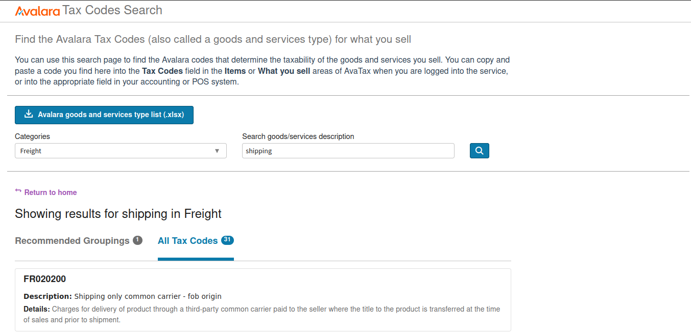
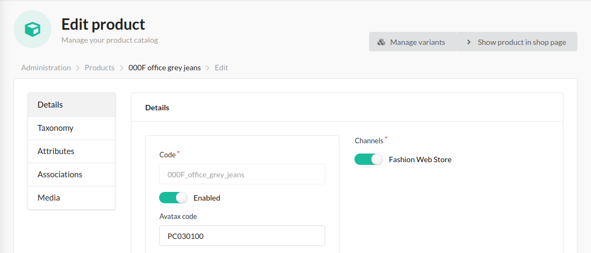
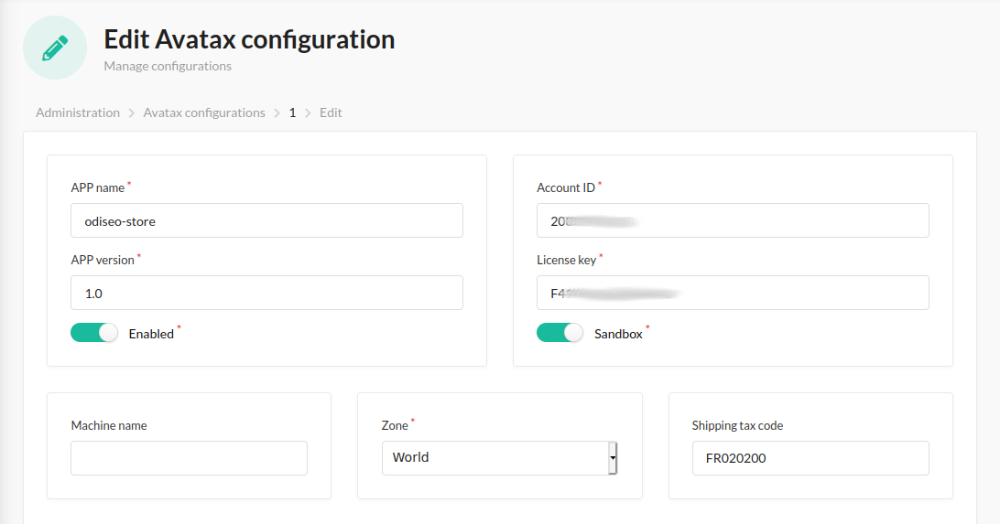

## Tax codes

This plugin uses default Avatax codes for products and shipping, but you can configure it.

1. Find the codes that best suit your Store in the [Tax Codes Search](https://taxcode.avatax.avalara.com/):

   
   

2. With this codes, go to the admin section and add it:

   
   
